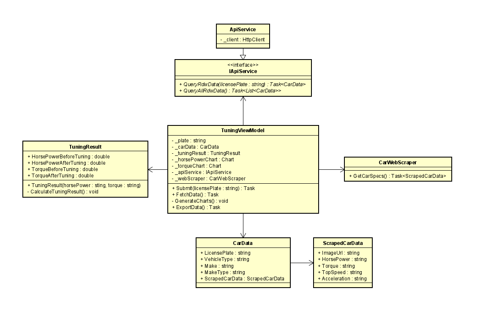

# C# threading

## Opdrachtomschrijving

Het idee is om een app te ontwikkelen, waarbij klanten kunnen zien hoeveel vermogenswinst ze kunnen behalen met chiptuning aan de hand van hun kenteken. De klant voert zijn kenteken in, waarna de data van de auto wordt opgehaald aan de hand van de RDW api. Aangezien data zoals het vermogen en koppel niet beschikbaar is via de RDW, wordt daar een webscraper voor gebruikt.

De data wordt getoond op de front-end met een plaatje van de auto erbij. Ook wordt er een berekening uitgevoerd om het verschil in vermogen en koppel te tonen bij het tunen van de auto. Op basis van de originele en tuning data worden ook twee grafieken gegenereerd waarin het verschil visueel te zien is.Aangezien de formule voor het berekenen van de vermogenswinst ingewikkeld is en afhangt van veel verschillende factoren hebben we gekozen om zelf een simpelere formule te bedenken die dus niet accuraat is.

Naast deze functionaliteit zal het ook nog mogelijk zijn om data van de RDW op te halen en te exporteren.

De volgende vormen van threading zijn gebruikt:

- Het exporteren van de RDW data naar een tekstbestand wordt op een aparte thread gedaan
- Voor het ophalen van de RDW data gebruiken we Async I/O
- Voor het ophalen van 500000 RDW records gebruiken Task Parallel library / Async await
- In het grootste gedeelte van de app maken we ook gebruik van async await

## Requirements

**Must have**

- Ophalen van kenteken gegevens
- Berekenen van vermogenswinst
- Genereren van grafieken
- User interface
- Gebruik van threading

**Should have**

- Exporteren van RDW data naar tekstbestand
- Mooie user interface

**Could have**

- Een race game
- 3D model van de auto tonen
- Een offerte genereren voor de klant

**Wont have**

- Auto gegevens ophalen via merk/model/uitvoering

## Class diagram

